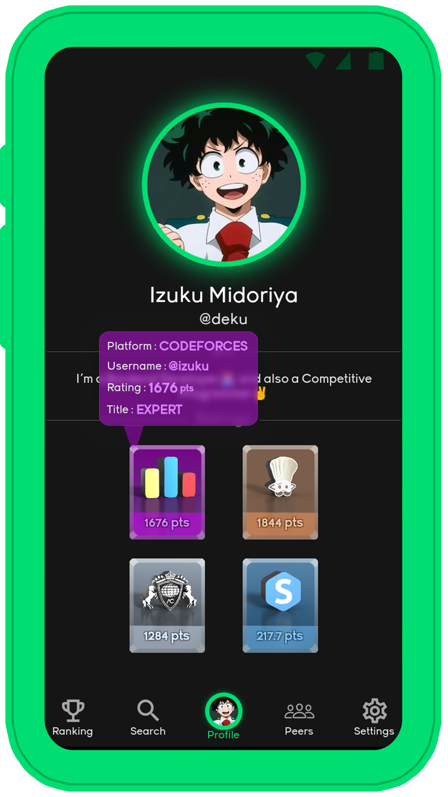
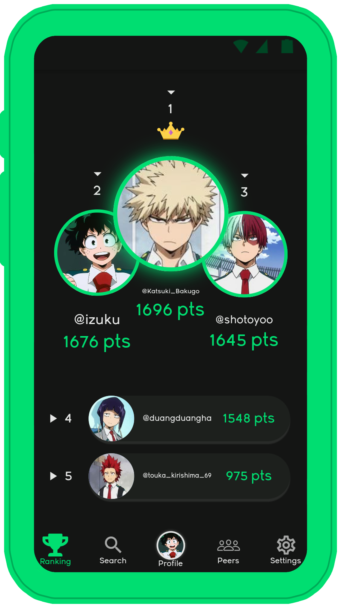

# CoderStatus App

A flutter app with a  *Firebase Backend* for *Competitive Programmers*, in this app you create a profile and add your User Handles from different Competitive Programming websites and your *Ratings* will be displayed in your dashboard. You can add your friends as *Peers*, see their progress and also see *ranking* among your peers for a specific competitive website.

 

## Preview

  

 

## Rive Animations
   These are the Rive Animations I have made for my project, I have Open Sourced all of them you can check them out [here](https://rive.app/curiousyuvi/)

    

 

## Supported Competitive Websites
- **Codeforces**
- **Codechef**
- **Atcoder**
- **Spoj**

 

## Get Started

### Prerequisites

You need to have **Flutter SDK** installed , if not install it from [here](https://flutter.dev/docs/get-started/install)

### Installing
Clone this repository, open it in an IDE and in the root directory run :

`flutter pub get`

then connect your emulator/simulator/physical device and run :

`flutter run`

 

## Documentation

For help getting started with Flutter, view online [documentation](https://flutter.dev/docs)

 

## Contributing

Contributions are always welcome!

Contact[@curiousyuvi](https://www.github.com/curiousyuvi) for any guidance