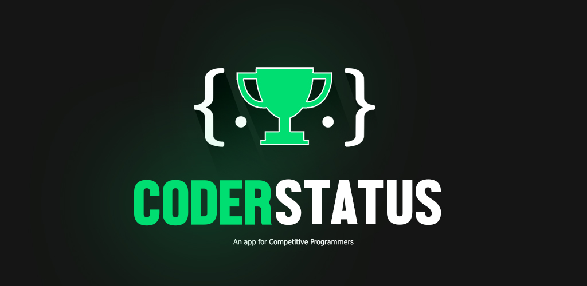
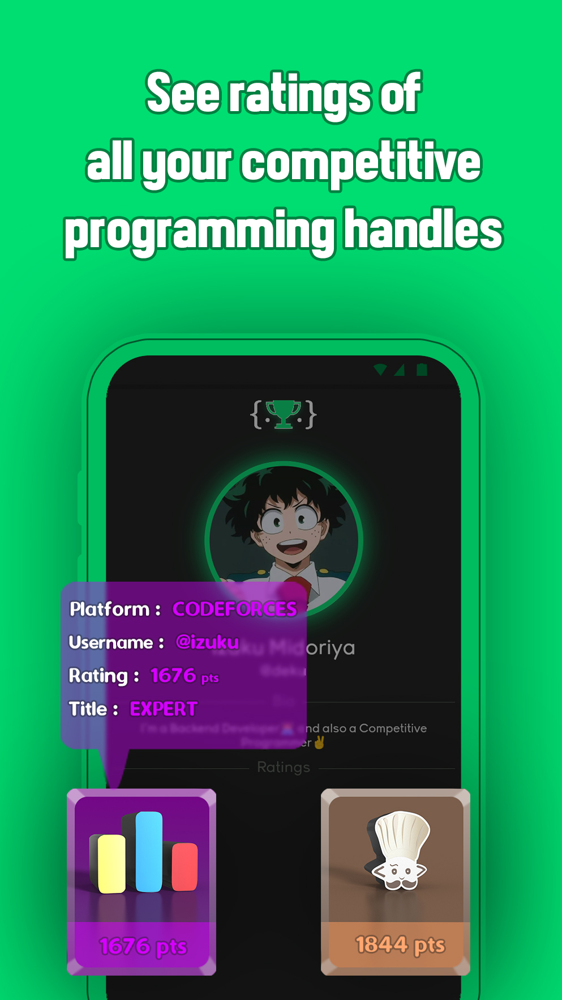
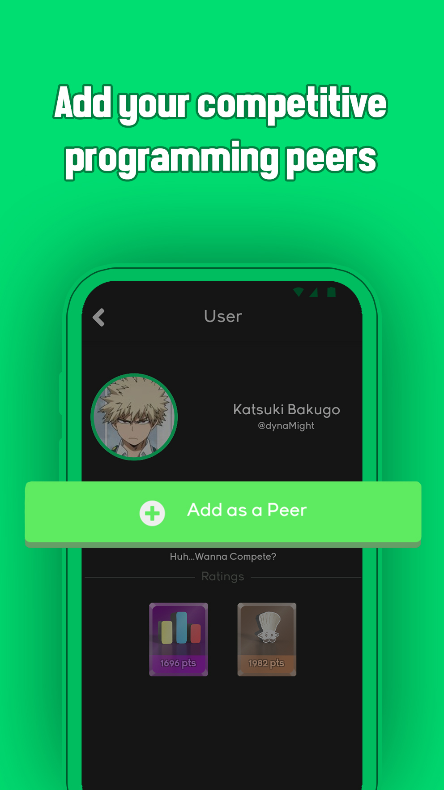
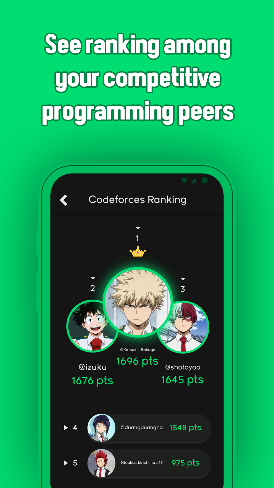
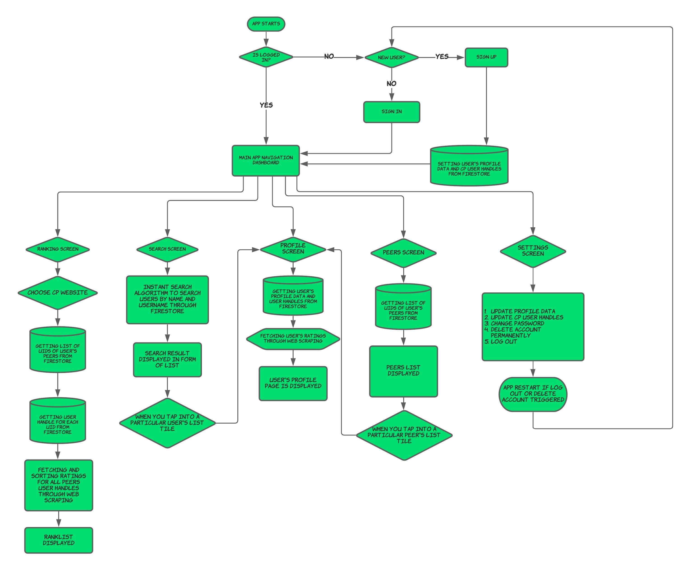
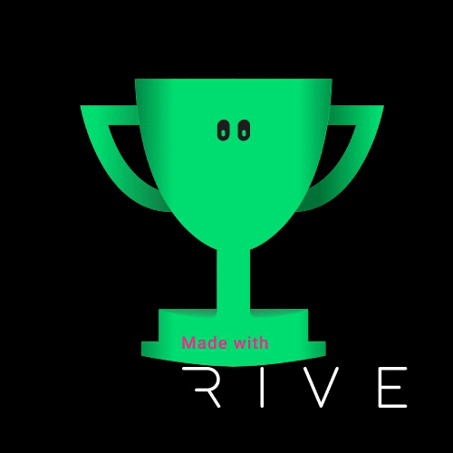
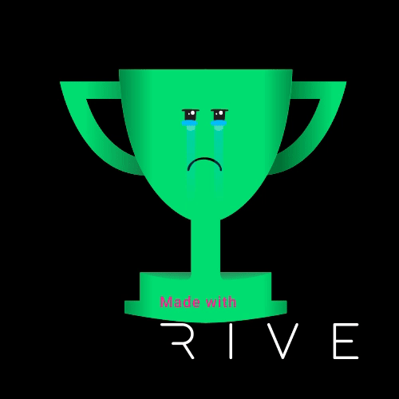
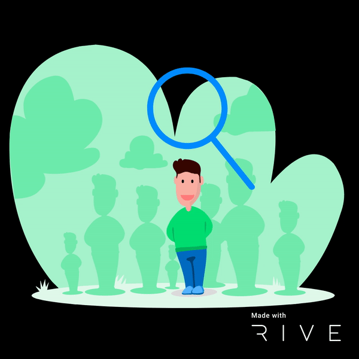
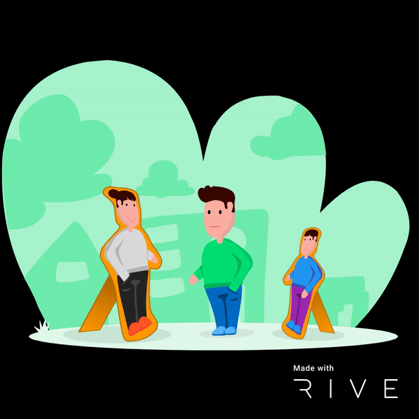

# CoderStatus App

A _flutter_ app that uses _web-scraping_ and has a _Firebase Backend_, this app is for competitive programmers in this app you create a profile and add your User Handles from different Competitive Programming websites and your Ratings will be displayed in your dashboard. You can add your friends as Peers, see their progress and also see ranking among your peers for a specific competitive website.

> Do you know why you play multi-player games with your friends so seriously? Even though you know it's just a game, that's because you want to rise in the ranks among your friends in that game and that gives you a feeling of accomplishment. Ever wondered if you can get the same strife towards your Competitive Problem Solving, turns out you can with this app.

 

## Preview

  

 

## Demo

https://user-images.githubusercontent.com/58589519/132042365-16c142db-766c-4d61-8d1a-f2f149ed617a.mp4

 

## Diagram

 

## Rive Animations

These are the Rive Animations I have made for my project, I have Open Sourced all of them you can check them out [here](https://rive.app/curiousyuvi/)

    

 

## Supported Competitive Websites

- **Codeforces**
- **Codechef**
- **Atcoder**
- **Spoj**

 

## Get Started

### Prerequisites

You need to have **Flutter SDK** installed , if not install it from [here](https://flutter.dev/docs/get-started/install)

### Installing

Clone this repository, open it in an IDE and in the root directory run :

`flutter pub get`

then connect your emulator/simulator/physical device and run :

`flutter run`

 

## Documentation

For help getting started with Flutter, view online [documentation](https://flutter.dev/docs)

 

## Contributing

Contributions are always welcome!

Contact [@curiousyuvi](https://www.github.com/curiousyuvi) for any guidance

#### Show some :heart: love and :star: star this repository
